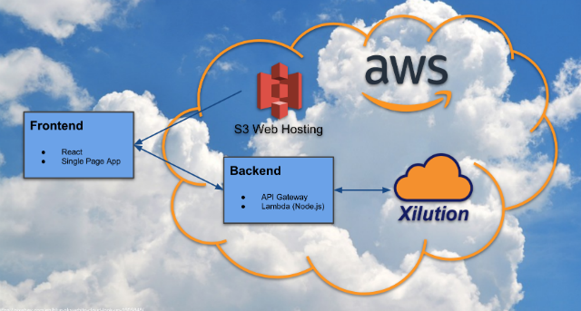

<h1 align="center" style="border-bottom: none;">xilution-react-todomvc</h1>
<h3 align="center">A Serverless Example of TodoMVC</h3>

This is a full-stack example of the ubiquitous <a href="http://todomvc.com/">TodoMVC app</a> using a <a href="https://en.wikipedia.org/wiki/Serverless_computing">serverless computing model</a>.
Follow the instructions below to stand up an example of the app for yourself.
Within about a 1/2 hour you will have a fully functional todo management app running in AWS.

  
  
  
  

  
  
  

  

  

## Great For

* This example is ideally suited for...
	* Digital agencies who want to accelerate client project time lines and extend their technical capabilities.
	* Hackathon teams who want a complete full-stack example upon which they can base their projects.
	* Frontend developers with backend responsibilities who just want to code awesome web and mobile apps.
	* Technical leaders who are always on the look out for next big productivity accelerator.
	* Backend developers who want to sharpen their technical skill sets.

## Features

* 💯 Unit Test Coverage

* Frontend
	* Use Cases
		* Login User
		* View Todos
		* Create/Update/Delete Todos
	* [Single Page Web Application](https://en.wikipedia.org/wiki/Single-page_application)
	* [Hosted On AWS S3](https://docs.aws.amazon.com/AmazonS3/latest/dev/WebsiteHosting.html)
	* [React](https://reactjs.org/)
		* [React-Redux](https://github.com/reactjs/react-redux)
		* [React-Router](https://github.com/ReactTraining/react-router)
		* [React-Bootstrap](https://react-bootstrap.github.io/)
	* [Node.js](https://nodejs.org/en/) version 10.16.3 for React Code
	* [Webpack](https://webpack.js.org/) Build
	* [Jest](https://facebook.github.io/jest/) Unit Testing
	* [ESLint](https://eslint.org/) for Beautifully Consistent JavaScript Code Style
		
* Backend
	* [Serverless](https://en.wikipedia.org/wiki/Serverless_computing) Architecture 🤘
	* [RESTful Web Service](https://en.wikipedia.org/wiki/Representational_state_transfer)
		* Supports Frontend Use Cases
	* Proper [CORS](https://developer.mozilla.org/en-US/docs/Web/HTTP/CORS) [configuration](https://github.com/xilution/xilution-react-todomvc/blob/master/aws/cloud-formation/template-sam.yml#L26)
	* [Amazon Web Services](https://aws.amazon.com/)
		* [Serverless Application Model (SAM)](https://github.com/awslabs/serverless-application-model)
		* [API Gateway](https://aws.amazon.com/api-gateway/)
		* [Lambda (Node.js)](https://aws.amazon.com/lambda/)
		* [CloudFormation](https://aws.amazon.com/cloudformation/)
	* Input validation via [Joi](https://github.com/hapijs/joi)
	* [Node.js](https://nodejs.org/en/) version 10.16.3 for Lambda Code
	* [Webpack](https://webpack.js.org/) Build
		* Technique used to reduce size of deployed code.
	* [Jest](https://facebook.github.io/jest/) Unit Testing
	* [ESLint](https://eslint.org/) for Beautifully Consistent JavaScript Code Style
	* Integrates with [Xilution APIaaS](https://test.xilution.com)
		* [Xilution - Basics - Beagily](https://test.products.xilution.com/basics/beagily)
		* [Xilution - Core - Authentication](https://test.products.xilution.com/core/authentication)
		* [Xilution - Core - Account Management](https://test.products.xilution.com/core/account-management)

  

## Prerequisites

This example was developed on [macOS High Sierra](https://www.apple.com/macos/high-sierra/) using [WebStorm](https://www.jetbrains.com/webstorm/).
Your experience on other development platforms will vary.
If you find inconsistencies with these instructions and develop a solution for your development platform, please share your experience through a pull request.

For Windows users, I recommend using Git Bash for command line steps.
Git Bash is included in the Git installation mentioned below.
For Mac users, the Terminal application is the best way to go for command line steps.

1. [Create an AWS Account](https://aws.amazon.com/free/)
	* AWS offers a 12 month Free trial.

1. [Create a Xilution Account in our Test Environment](https://test.register.xilution.com)
	* Limited access to Xilution's Test environments is Free for registered users.
	* Open https://register.xilution.com, to create an account in our Production environment.
		* At this time, Test and Production accounts don't synchronize.

1. [Activate Xilution - Basics - Beagily](https://test.portal.xilution.com)
	* Some Xilution APIaaS products require activation to enable access.
	* Without activation, you will receive 401 errors when making calls to Beagily's endpoints.

1. [Install Git](https://git-scm.com/downloads)

1. [Install AWS CLI](https://aws.amazon.com/cli/)
	1. You'll need python 3 to get access to the latest AWS CLI commands.

1. [Install Node Version Manager (nvm)](https://github.com/creationix/nvm)

1. [Install Yarn](https://yarnpkg.com/)

1. [Install ./jq](https://stedolan.github.io/jq/)
	* This will quickly become one of your favorite command line utilities. 😎

## One Time Set Up
	
1. [Create an AWS IAM User in your AWS Account](https://docs.aws.amazon.com/IAM/latest/UserGuide/id_users_create.html)
	* It's bad practice to use your AWS root account.
	* I recommend following the console instructions.
	* When you get to the "Set permissions" step, attach an existing policy and choose "AdministratorAccess".
	  You can change the access at anytime.
	  AWS will prompt you when you don't have sufficient access to a resource.

1. [Configure the AWS CLI](https://docs.aws.amazon.com/cli/latest/userguide/cli-chap-getting-started.html#cli-quick-configuration)
	* Remember your region for configuration later.

1. Open a command line app.
	* Mac: Terminal
	* Windows: Git Bash
	
1. Download Project Source Code
	* Some of these steps may be superfluous for experienced developers.
	For those less experienced coders, I recommend following these steps verbatim.
	
	1. Run `cd ~` to navigate to your home directory.
	1. Run `mkdir Developer` to create a directory to keep development related things.
	1. Run `cd Developer` to navigate into the Developer directory.
	1. Run `mkdir git` to create a directory to keep code cloned through git.
	1. Run `cd git` to navigate into the git directory.
	1. Run `git clone https://github.com/xilution/xilution-react-todomvc` to download the code for this example.
	1. Run `cd xilution-react-todomvc` to navigate into the directory where the code for this example has been downloaded.

1. Install Node.js 10.16.3
	1. From within the 'xilution-react-todomvc' directory, run `nvm install` to install the version of Node.js used by the example.

1. Download Project Dependencies
	1. From within the 'xilution-react-todomvc' directory, run `yarn` to install Node.Js dependencies.

1. Create a `config.mk` file to hold build settings
	* Look up your Xilution Client Id through the [Xilution Customer Admin Portal](https://test.portal.xilution.com).
	  Use the credentials you used to create your Xilution Subscriber Account.
	1. Run `touch config.mk` to create the file.
	1. Run `echo XILUTION_CLIENT_ID={REPLACE-WITH-YOUR-CLIENT-ID} >> config.mk` to save your xilution client identifier to the config.
	1. Run `echo AWS_STAGING_BUCKET={REPLACE-WITH-A-UNIQUE-STAGING-BUCKET-NAME} >> config.mk` to save a staging bucket name to the config.
		* AWS S3 bucket names must be unique across all AWS S3 buckets. We recommend prefixing your bucket name with your organization name to prevent naming conflicts.
	1. Run `echo AWS_WEBSITE_BUCKET={REPLACE-WITH-A-UNIQUE-WEBSITE-BUCKET-NAME} >> config.mk` to save a website bucket name to the config.
		* AWS S3 bucket names must be unique across all AWS S3 buckets. We recommend prefixing your bucket name with your organization name to prevent naming conflicts.
	1. Run `echo AWS_REGION={REPLACE-WITH-YOUR-AWS-REGION} >> config.mk` to save your AWS account's region to the config.

## Provision and Deploy

1. Open a command line app.
	* Mac: Terminal
	* Windows: Git Bash

1. Provision and Deploy Backend Resources
	1. Run `make provision-base` to provision the base AWS resources.
		* See [./aws/cloud-formation/template-base.yml](https://github.com/xilution/xilution-react-todomvc/blob/master/aws/cloud-formation/template-base.yml)
		* Checkout the 'xilution-todomvc-base' stack using the [AWS CloudFormation console](https://console.aws.amazon.com/cloudformation/home).
		* This step takes a couple of minutes to complete.
	1. Run `make build-backend` to build the backend resources.
	1. Run `make deploy-backend` to deploy the backend resources to your AWS account.
		* Provisions API Gateway and Lambda resources.
		* See [./aws/cloud-formation/template-sam.yml](https://github.com/xilution/xilution-react-todomvc/blob/master/aws/cloud-formation/template-sam.yml)
		* Checkout the 'xilution-todomvc-sam' stack using the [AWS CloudFormation console](https://console.aws.amazon.com/cloudformation/home).
	1. Run `make show-backend-url` to see the URL of the backend RESTful web service.
	1. Run `make put-types` to register JSON schema used by this example with Xilution - Basics - Beagily.
		* You will be prompted for credentials.
		  Use the credentials you used to create your Xilution account.

1. Deploy Frontend Resource
	1. Run `make build-frontend` to build the frontend resources.
	1. Run `make deploy-frontend` to deploy the frontend resources.
	1. Run `make show-frontend-url` to see the URL of the frontend application.
	1. Copy the front end URL and paste it into a browser.
		* You should see the login for for the TodoMVC app.

👏👏👏 The example should now be up and running in AWS. 👏👏👏

## To Test

1. Open a command line app.
	* Mac: Terminal
	* Windows: Git Bash

1. To Run Linter and Unit Tests
	1. Run `yarn test` to run the linter and run unit tests.

1. To Run the App Locally
	1. Run `make dev` to run the app locally.
		* make is necessary to automatically inject the backend url.

1. User Acceptance Testing
	1. Run `make show-frontend-url` to see the URL of the frontend application.
	1. Copy the front end URL and paste it into a browser.
	1. Run through the different use cases
		* Login User
			* Use your Xilution user credentials
		* View Todos
		* Create/Update/Delete Todos

## Troubleshooting

1. Backend
	* CloudWatch Logs
		* Open the [AWS CloudWatch console](https://console.aws.amazon.com/cloudwatch/home).
			* Lambdas
				* Click Logs in the left hand menu.
				* Search for '/aws/lambda' to see a list of provisioned Lambda functions.
				* Choose the Lambda function associated with the endpoint giving you trouble.
				* Browse through the logs for error messages.
				* I've found it most effective to find error messages by time.
			* API Gateway
				* Finding CloudWatch logs for API Gateway is a little trickier than Lambda.
				* Open the [AWS APIGateway console](https://console.aws.amazon.com/apigateway/home)
				* Find the API ID for the `xilution-todo-sam` API.
				* Go back to the AWS CloudWatch console.
				* Click Logs in the left hand menu.
				* Search for 'API-Gateway-Execution-Logs_{REPLACE-WITH-API-ID}/Prod'

1. Frontend
	* Google Chrome
		* [Open the Chrome Developer Console](https://developers.google.com/web/tools/chrome-devtools/console/)
		* Errors appear in the Console tab and will have a Error ID.
		* You can get a more detailed description of the error by finding the Error ID in CloudWatch Logs.
		* Also use the Network tab to observe how the app is interacting with the API.

1. Bugs
	* If you have found an issue with 'xilution-react-todomvc', [please submit a bug](https://github.com/xilution/xilution-react-todomvc/issues).

## Deprovisioning

1. Open a command line app.
	* Mac: Terminal
	* Windows: Git Bash

1. Deprovision Resources
	1. Run `make deprovision-backend` to deprovision backend resources.
		* See [./aws/cloud-formation/template-sam.yml](https://github.com/xilution/xilution-react-todomvc/blob/master/aws/cloud-formation/template-sam.yml)
	1. Using the [AWS Console](http://aws.amazon.com/console/home), delete the S3 buckets
		* xilution-todomvc-website-bucket
		* xilution-todomvc-staging-bucket
	1. Run `make deprovision-base` to deprovision the base resources.
		* See [./aws/cloud-formation/template-base.yml](https://github.com/xilution/xilution-react-todomvc/blob/master/aws/cloud-formation/template-base.yml)
		
## Next Steps

I'm hopeful that this reference implementation inspires you to to use AWS SAM and React for your next web application.
I also invite you to learn more about how [Xilution APIaaS](https://test.xilution.com) can accelerate your next web or mobile application project.

Need help with your serverless project?
[Hit me up on Twitter.](https://twitter.com/tbrunia)
I would be happy to pitch in where I can.

## FAQ

1. 💰 How much does it cost to run this example?
	* [AWS offers a "free" tier](https://aws.amazon.com/free/) which enables you to gain free, hands-on experience with the AWS platform, products and services.
	* You may find the [AWS Simple Monthly Calculator](https://calculator.s3.amazonaws.com/index.html) to be useful in calculating your monthly AWS expense as well.
	* Pricing for AWS managed services used in this example
		* [Lambda](https://aws.amazon.com/lambda/pricing/)
			* Highlight: The first 1 million requests per month are free for all subscribers! 🎉
		* [API Gateway](https://aws.amazon.com/api-gateway/pricing/)
		* [S3](https://aws.amazon.com/s3/pricing/)
		* [CloudFormation](https://aws.amazon.com/cloudformation/pricing/)
		* For comparison, here is AWS's published pricing for virtual server and managed server services.
			* [EC2](https://aws.amazon.com/ec2/pricing/)
			* [ECS](https://aws.amazon.com/ecs/pricing/)
				* Includes [Fargate](https://aws.amazon.com/fargate/) and EC2 Launch Types Models
			* [ElasticBeanstalk](https://aws.amazon.com/elasticbeanstalk/pricing/)
	* Pricing for Xilution APIaaS Products used in this example
		* This example integrates with Xilution's Test environment which is Free for evaluation purposes.
		* The Xilution APIaaS products highlighted in this example have not yet been released for production consumption.
		* See [the Xilution APIaaS Products page](https://test.products.xilution.com) for the latest product phase and pricing details.
		* For comparision, here is AWS's published pricing for data storage services.
			* [RDS](https://aws.amazon.com/rds/pricing/)
			* [DynamoDB](https://aws.amazon.com/dynamodb/pricing/)

1. Why React?
	* React was chosen for this example's frontend because of its pervasiveness and (most importantly) its [unit testability](https://facebook.github.io/jest/docs/en/tutorial-react.html).
	* Other [JavaScript frameworks](https://en.wikipedia.org/wiki/Comparison_of_JavaScript_frameworks) like [Angular](https://angular.io/) or [Vue.js](https://vuejs.org/) could be used as the frontend for this example.

1. Is the backend necessary?
	* The backend is useful for abstracting secrets and domain specific functionality from the frontend.

1. Why Node.js for the backend? Are there alternative programming languages?
	* Node.js was selected for the backend of this example to provided a consistent programming experience between the frontend and the backend.
	* [AWS Lambda supports many other programming languages](https://docs.aws.amazon.com/lambda/latest/dg/lambda-app.html) including [Java](https://en.wikipedia.org/wiki/Java_(programming_language)), [C#](https://en.wikipedia.org/wiki/C_Sharp_(programming_language)), [Python](https://en.wikipedia.org/wiki/Python_(programming_language)) and [Go](https://en.wikipedia.org/wiki/Go_(programming_language)).

1. Can this example run on other public cloud platforms?
	* In theory, yes.
	  [Azure](https://azure.microsoft.com) and [Google Cloud Platform](https://cloud.google.com/) offer similar types of web hosting and compute services needed to run this example.
	  Eventually, I would like to develop [Terraform](https://www.terraform.io/) templates for several different public cloud platforms.
	  If you're passionate about your cloud platform and would like to see it incorporated in this example, I invite you to submit a pull request.

1. What about the [Serverless](https://serverless.com/) framework?
	* I personally don't have experience working with the Serverless framework, but I hear good things.
	  The pervasiveness of the framework warrants a mention in this example's FAQ.
	  I [applaud the maintainers of the framework](https://serverless.com/company/team/) for their advancement of serverless computing.
	  I would like to learn more about the framework and how it could be incorporated into this example.
	  If you're passionate about the Serverless framework or other similar frameworks, I invite you to submit a pull request.

1. Do I have to use Xilution APIaaS?
	* Nope.
	  You can use just about any persistance model in your backend implementation including other API as a Service providers.
	  AWS [RDS](https://aws.amazon.com/rds/) and [DynamoDB](https://aws.amazon.com/dynamodb/) are valid alternatives if you choose to provision and maintain your own persistence infrastructure.
	  However, I think you'll reconsider investing in a relational or noSQL database and choose API as a Service when you consider the productivity gains that a serverless architecture model has already afforded you.
	  In a way, API as a Service is like the icing on the cake.
	  If you're interested in learning more about API as a Service, [this blog article Ed Shelley](https://blog.chartmogul.com/api-based-saas/) is a good place to start.

## Issues

[Issues are managed here.](https://github.com/xilution/xilution-react-todomvc/issues)

## About the Author

[Todd Brunia](https://twitter.com/tbrunia) is the founder of [Xilution](https://xilution.com).
Xilution creates and markets API as a Service products.

## Contributions

See something about this example that you think could be improved? 
Pull requests are encouraged and greatly appreciated!
